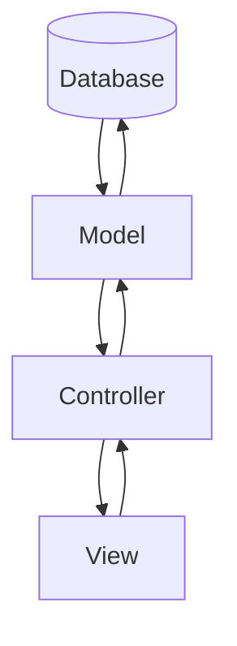

# Frappe MVC Architecture

Frappe follows the Model-View-Controller (MVC) architectural pattern. This pattern helps developers organize their code into distinct components responsible for specific tasks, thus promoting modularity and maintainability.

## Model

- **Purpose**: The Model represents the application's data, business logic, and database interactions. It encapsulates the structure of the database tables and defines how data is stored, retrieved, and manipulated.

- **Implementation**: In Frappe, models are defined using Python classes that inherit from the `frappe.db.Document` class. These classes define the structure of database tables and can include validation rules, triggers, and methods to interact with data.
- **Example**: A "Customer" model might define the structure of the "Customer" database table and include methods for creating, updating, and retrieving customer records.

## View

- **Purpose**: The View represents the presentation layer of the application, responsible for rendering the user interface and displaying data to users. It includes templates, HTML, CSS, and client-side JavaScript.
- **Implementation**: Frappe uses a templating engine based on Jinja2 for rendering dynamic content in HTML templates. Templates are associated with models and define how data is displayed to users.
- **Example**: An HTML template might display customer details retrieved from the "Customer" model.

## Controller

- **Purpose**: The Controller acts as an intermediary between the Model and View. It handles user input, processes requests, invokes appropriate methods on the Model, and renders the appropriate View.
- **Implementation**: In Frappe, controllers are typically implemented as Python scripts that define routes and handle HTTP requests. Frappe uses the `frappe.get_doc` function to interact with models and fetch data.
- **Example**: A controller script might handle a request to create a new customer, validate the input, invoke the "Customer" model to save the data, and then render a success or error view.

## Router

- **Purpose**: The Router maps URLs to Controller functions, ensuring that the correct Controller is invoked for each HTTP request.
- **Implementation**: Frappe's router is configured in the `hooks.py` file and uses URL patterns and routes to determine which Controller function should handle each request.
- **Example**: A URL like `/customer/new` might be mapped to a Controller function that handles the creation of a new customer.

Frappe's MVC architecture promotes separation of concerns, making it easier to develop, test, and maintain applications.
